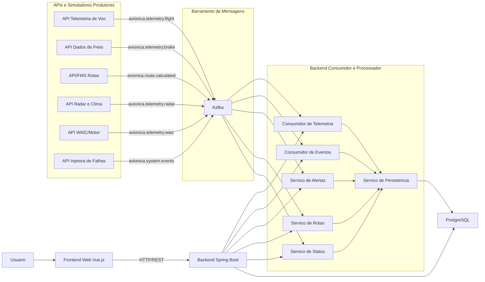

# Introducao e Fluxo do Sistema

## Visao Geral

O sistema e uma plataforma distribuida de monitoramento avionico. Ele simula sensores e sistemas de uma aeronave, envia os dados por mensageria, processa essas informacoes no backend e disponibiliza tudo em uma interface web.

A arquitetura proposta e orientada a mensagens. Os modulos produtores nao enviam os dados diretamente para o backend por chamada HTTP. Em vez disso, eles publicam mensagens em topicos Kafka. O backend consome essas mensagens, aplica regras de negocio, salva os dados no banco e disponibiliza os recursos para o frontend.

## Por Que o Sistema e Orientado a Mensagens

O sistema pode ser considerado orientado a mensagens porque:

- os dados dos sensores sao enviados como mensagens;
- o Kafka funciona como barramento entre produtores e consumidores;
- os produtores nao precisam conhecer os consumidores;
- o backend processa os dados de forma assincrona;
- novos consumidores podem ser adicionados sem alterar os produtores;
- falhas em um consumidor nao impedem imediatamente os produtores de publicarem dados.

O frontend Vue nao consome Kafka diretamente. Ele acessa o backend Spring Boot por API REST, o que mantem a interface desacoplada da mensageria e do banco de dados.

## Fluxo Principal

1. Os modulos de API/simuladores geram dados de sensores, radar, motor, freio, rota e falhas.
2. Esses modulos publicam mensagens nos topicos Kafka.
3. O Kafka recebe e organiza as mensagens por topico.
4. O backend Spring Boot consome as mensagens do Kafka.
5. O backend valida, processa e transforma os dados recebidos.
6. O backend salva os dados processados no PostgreSQL.
7. O frontend Vue chama endpoints REST do backend.
8. O usuario visualiza telemetria, historico, rotas, alertas, eventos e status dos modulos pela interface web.

## Diagrama do Sistema

## Responsabilidades por Camada

### API e Simuladores

Responsaveis por gerar os dados do dominio avionico:

- telemetria de voo;
- freios;
- radar e clima;
- motor/WAIC;
- planejamento de rota;
- falhas e eventos.

Esses modulos atuam como produtores de mensagens.

### Kafka

Responsavel por receber, organizar e distribuir mensagens entre os modulos. Ele e infraestrutura de mensageria e nao deve ser contado como modulo da equipe, mas os produtores e consumidores desenvolvidos pela equipe contam.

### Backend Spring Boot

Responsavel por:

- consumir mensagens do Kafka;
- aplicar regras de negocio;
- gerar alertas;
- organizar dados em DTOs;
- persistir informacoes no banco;
- expor endpoints REST para o frontend.

As camadas `model`, `dto` e `service` fazem parte da organizacao interna do backend e nao contam como modulos distribuidos separadamente.

### Banco de Dados

Responsavel por armazenar historico de telemetria, eventos, rotas, alertas e status dos modulos. O banco nao conta como modulo distribuido.

### Frontend Vue

Responsavel por permitir que o usuario acesse as funcionalidades do sistema pela web:

- dashboard;
- telemetria;
- historico;
- rotas/CDU;
- alertas;
- eventos;
- status dos modulos.

O frontend conta como modulo de interface grafica, mas suas telas internas nao devem ser apresentadas como processos distribuidos independentes.

## Conclusao

A arquitetura esta alinhada com um sistema orientado a mensagens, pois o Kafka fica no centro da comunicacao assincrona entre os produtores de dados e o backend consumidor. O backend concentra a persistencia e as regras de negocio, enquanto o frontend Vue acessa tudo por API REST.
